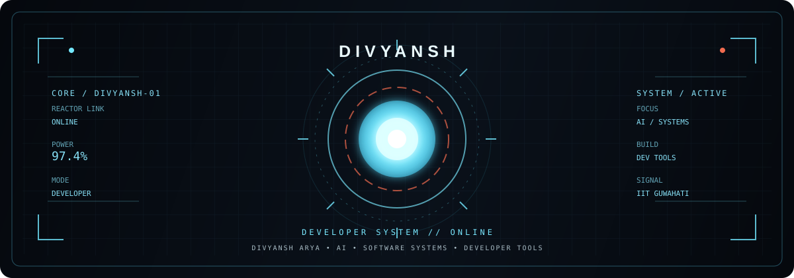

<p align="center">
  
</p>

B.Tech CSE • Minor in Data Science @ IIT Guwahati


[](https://www.linkedin.com/in/divyansh-arya-075b98334/)
[](https://github.com/dvfens)


---

## 🤖 SYSTEM PROFILE

> **Computer Science Engineering student building at the intersection of software, AI, and developer tools.**

Currently pursuing **B.Tech in CSE at SRM University, Andhra Pradesh**, along with a **Minor in Data Science from IIT Guwahati**.

I learn by building — from payment systems to AI-powered developer infrastructure.

```text
STATUS        : ONLINE
CURRENT MODE  : BUILDING
FOCUS         : AI • SYSTEMS • DEVELOPER TOOLS
NEXT MISSION  : CLASSIFIED
```

---

## 🛠️ TECHNOLOGY ARSENAL

<div align="center">

### LANGUAGES


### TOOLS


</div>

---

# 🦾 ARMOR DEVELOPMENT PROGRAM

### ⚡ MARK-I — BitSend

`FINTECH` • `COMPLETED`

Hybrid payment system built to explore modern payment workflows.

---

### 🧠 MARK-II — KYROSIS

`AI / SYSTEMS` • `IN DEVELOPMENT`

A modular **AI-powered spatial operating system foundation** built around:

`EVENT BUS` • `PLUGINS` • `REASONING` • `MEMORY` • `VOICE` • `VISION`

---

### 🛰️ MARK-III — GitMind AI

`AI / DEVELOPER TOOLS` • `IN DEVELOPMENT`

AI-powered repository intelligence platform that helps developers understand unfamiliar GitHub repositories.

**Powered by**

`Coral SQL` • `GitHub Signals` • `OpenRouter`

---

<div align="center">

### `3 SYSTEMS • 1 MISSION`

</div>

---

# 🏆 MISSION LOG

| | Mission | Status |
|---|---|---|
| 🎓 | Minor in Data Science — IIT Guwahati | `ACTIVE` |
| 💻 | B.Tech CSE — SRM AP | `3rd YEAR` |
| 🏢 | Internship — Sylicca LLC | `COMPLETED` |
| 🌐 | ETHGlobal Hackathon | `PARTICIPANT` |
| 🏆 | Odoo Hackathon | `SEMIFINALIST • 19K+` |
| 🏆 | Flipkart GRiD 8.0 | `SEMIFINALIST` |

---

# ⚡ CURRENT OBJECTIVES

```text
┌──────────────────────────────────────────────────────┐
│                                                      │
│  [01]  BUILD AI-POWERED SYSTEMS                     │
│                                                      │
│  [02]  CREATE BETTER DEVELOPER TOOLS                │
│                                                      │
│  [03]  MASTER SOFTWARE ENGINEERING                  │
│                                                      │
│  [04]  SHIP MORE. LEARN MORE.                      │
│                                                      │
└──────────────────────────────────────────────────────┘
```

---

# 📊 GITHUB TELEMETRY

<div align="center">


</div>

---

# 🧠 DEVELOPMENT PROTOCOL

<div align="center">

`LEARN` → `BUILD` → `BREAK` → `DEBUG` → `IMPROVE` → `REPEAT`

<br>

> **"The best way to learn is to build."**

</div>

---

# 📡 COMMUNICATION CHANNEL

<div align="center">

[](https://www.linkedin.com/in/divyansh-arya-075b98334/)

[](https://github.com/dvfens)

</div>

---

<div align="center">

```text
╔══════════════════════════════════════════════════════╗
║                                                      ║
║       J.A.R.V.I.S. // SYSTEM STATUS: ONLINE       ║
║                                                      ║
║              NEXT MISSION: UNKNOWN                  ║
║                                                      ║
╚══════════════════════════════════════════════════════╝
```

### ⚡ `BUILD. BREAK. LEARN. REBUILD.`

</div>
